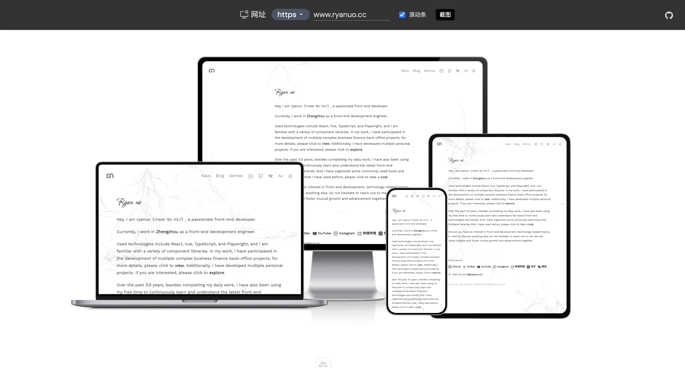

# mts 设备预览组件

本项目是一个基于 Nuxt4 和 UnoCSS 的多设备网页预览组件，支持电脑、笔记本、手机、平板四种设备模拟，支持自定义网址、滚动条、协议切换等功能。

## 预览效果



## 技术栈

- [Nuxt4](https://nuxt.com/)
- [UnoCSS](https://unocss.dev/)
- [Vue 3](https://vuejs.org/)

## 主要功能

- 多设备预览（电脑、笔记本、手机、平板）
- 支持自定义每种设备的网址
- 支持切换 http/https 协议
- 支持显示/隐藏滚动条
- 预览时点击空白处可关闭预览
- 响应式布局，适配不同屏幕宽度

## 使用方法

1. 安装依赖

   ```bash
   pnpm install
   # 或
   npm install
   ```

2. 启动开发环境

   ```bash
   pnpm dev
   # 或
   npm run dev
   ```

3. 在页面或布局中引入组件

   ```vue
   <DevicePreview />
   ```

## UnoCSS 配置建议

- 推荐在 `unocss.config.ts` 中 safelist 设备预览区的背景图相关类名。
- iconfont 建议通过 CDN 或本地引入。

## 目录结构

- `components/DevicePreview.vue` 设备预览主组件
- `assets/images/new-model/` 设备模拟图片资源

## 贡献与反馈

如有建议或问题，欢迎提交 issue 或 PR。
